---
title: "Dify (Linux版)"
author: "Gen K. Mariendorf"
catch: "ローカルＬＬＭとＲＡＧで作る業務で使える実践ＡＩ基盤"
version: '第一版'
include-before: \input{tex/preface}
header-includes:
  - \usepackage{graphicx}
  - \usepackage{fancyhdr}
  - \usepackage{amsmath}
  - \usepackage{amssymb}
  - \usepackage{titlesec}
  - \usepackage{hyperref}
  - \usepackage{tcolorbox}
  - \usepackage{xcolor}
  - \usepackage{framed}
  - \definecolor{oreillyRed}{RGB}{227,26,28}
  - \definecolor{oreillyGray}{RGB}{51,51,51}
  - \titleformat{\chapter}[display]{\normalfont\huge\bfseries\color{oreillyRed}}{\chaptertitlename\ \thechapter}{20pt}{\Huge}
  - \titlespacing*{\chapter}{0pt}{50pt}{40pt}
  - \titleformat{\section}{\normalfont\Large\bfseries\color{oreillyRed}}{\thesection}{1em}{}
  - \titleformat{\subsection}{\normalfont\large\bfseries\color{oreillyRed}}{\thesubsection}{1em}{}
  - \pagestyle{fancy}
  - \fancyhf{}
  - \fancyhead[LE,RO]{\thepage}
  - \fancyhead[LO]{\nouppercase{\rightmark}}
  - \fancyhead[RE]{\nouppercase{\leftmark}}
  - \fancyfoot[C]{}
  - \newtcolorbox{sidebar}[1][]{colback=oreillyGray!5!white, colframe=oreillyGray, fonttitle=\bfseries, title=#1}
  - '\patchcmd{\LT@array}{\@mkpream{#2}}{\StrGobbleLeft{#2}{2}[\pream]\StrGobbleRight{\pream}{2}[\pream]\StrSubstitute{\pream}{l}{|l}[\pream]\@mkpream{@{}\pream|@{}}}{}{}'
csl: ieee.csl
---


\newpage
# Ｄｉｆｙローカル環境の構築

この章では難しい理論やシステム説明は無しで、早速Ｄｉｆｙを動かしてみましょう。簡単な「具体的スクリプト」と方法をこの章ではまとめます。前提条件はOSはLinux、DifyはDocker Compose、OllamaはDockerホスト側で動かす、モデルは **deepseek-r1:1.5b**を使用します。


### ゴール

* Ollama + `deepseek-r1:1.5b` 起動
* Dify（Docker）起動
* **DifyからOllamaに接続して、チャット応答が返る**

要するに、Dify（Docker上で動作）$\rightarrow$ Ollama [Deepseek-r1:1.5b]と繋いで動かしてみる訳です。


## Ollama導入 & deepseek-r1:1.5bの起動

### Ollama インストール

```bash
$ curl -fsSL https://ollama.com/install.sh | sh
```

### モデル取得＆単体テスト

```bash
$ ollama pull deepseek-r1:1.5b
$ ln -vs /usr/share/ollama/.ollama $HOME
$ ollama run deepseek-r1:1.5b
```

#### モデルの保存場所は通常以下になる。

この例ではsymlinkを$HOME（ホームディレクトリ）へ作成

```bash
$ du -sh /usr/share/ollama/.ollama/models/
1,1G    /usr/share/ollama/.ollama/models/
```

* 環境変数：モデルの保存場所変更する場合は設定可。

```
$ export OLLAMA_MODELS=/usr/share/ollama/.ollama/models/
```

#### DeepSeekをOllamaでダウンロード

```bash
$ ollama pull deepseek-r1:1.5b
pulling manifest 
pulling manifest 
pulling aabd4debf0c8: 100%  1.1 GB
pulling c5ad996bda6e: 100%   556 B
pulling 6e4c38e1172f: 100%  1.1 KB
pulling f4d24e9138dd: 100%   148 B
pulling a85fe2a2e58e: 100%   487 B
verifying sha256 digest 
writing manifest 
success 
```

#### DeepSeekの起動：受け答えしてみる。$\rightarrow$ 成功

```bash
$ ollama run deepseek-r1:1.5b
>>> What is your name?
Greetings! I'm DeepSeek-R1, an artificial intelligence assistant created by DeepSeek. I'm at your service and would be delighted to assist you with any 
inquiries or tasks you may have.

>>> Send a message (/? for help)
```

\newpage


## Dify事前チェック（Dockerが動くか確認）

```bash
$ docker --version
$ docker compose version
```

#### 出力例

```
$ docker --version
Docker version 28.1.1, build 4eba377

$ docker compose version
Docker Compose version v2.35.1
```

### GPUコンテナを念の為チェック

`nvidia-smi`コマンドでGPUのチェックをします。

```
$ nvidia-smi

```

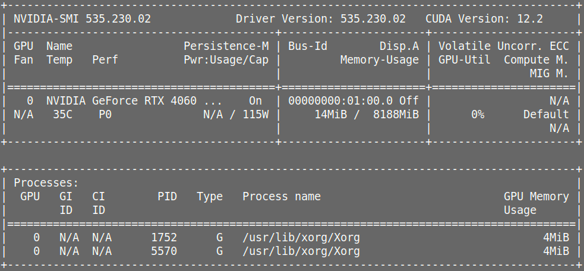

以下のようなシステム構成であることが分かりました。

| GPU                     | VRAM | Driver     | CUDA |
|:-----------------------:|:----:|:----------:|:----:|
| GeForce RTX 4060 | 8GB  | 535.230.02 | 12.2 |


## Dify（Docker Compose）を起動

公式のDocker Composeクイックスタートを参考にします。([docs.dify.ai Quick][1])

### Difyをclone（推奨：最新リリースタグ）

```bash
$ sudo apt-get update
$ sudo apt-get install -y jq curl git

git clone --branch "$(curl -s https://api.github.com/repos/langgenius/dify/releases/latest | jq -r .tag_name)" https://github.com/langgenius/dify.git
cd dify/docker
cp .env.example .env
docker compose up -d
```

### 起動確認（主要コンテナから起動）

```bash
docker compose ps
```

#### 起動確認：主要コンテナが稼働中

```
NAME                     IMAGE                                       COMMAND                  SERVICE         CREATED         STATUS                   PORTS
docker-api-1             langgenius/dify-api:1.13.0                  "/bin/bash /entrypoi…"   api             5 minutes ago   Up 5 minutes             5001/tcp
docker-db_postgres-1     postgres:15-alpine                          "docker-entrypoint.s…"   db_postgres     5 minutes ago   Up 5 minutes (healthy)   5432/tcp
docker-nginx-1           nginx:latest                                "sh -c 'cp /docker-e…"   nginx           5 minutes ago   Up 2 minutes             0.0.0.0:80->80/tcp, [::]:80->80/tcp, 0.0.0.0:443->443/tcp, [::]:443->443/tcp
docker-plugin_daemon-1   langgenius/dify-plugin-daemon:0.5.3-local   "/bin/bash -c /app/e…"   plugin_daemon   5 minutes ago   Up 5 minutes             0.0.0.0:5003->5003/tcp, [::]:5003->5003/tcp
docker-redis-1           redis:6-alpine                              "docker-entrypoint.s…"   redis           5 minutes ago   Up 5 minutes (healthy)   6379/tcp
docker-sandbox-1         langgenius/dify-sandbox:0.2.12              "/main"                  sandbox         5 minutes ago   Up 5 minutes (healthy)
docker-ssrf_proxy-1      ubuntu/squid:latest                         "sh -c 'cp /docker-e…"   ssrf_proxy      5 minutes ago   Up 5 minutes             3128/tcp
docker-weaviate-1        semitechnologies/weaviate:1.27.0            "/bin/weaviate --hos…"   weaviate        5 minutes ago   Up 5 minutes
docker-web-1             langgenius/dify-web:1.13.0                  "/bin/sh ./entrypoin…"   web             5 minutes ago   Up 5 minutes             3000/tcp
docker-worker-1          langgenius/dify-api:1.13.0                  "/bin/bash /entrypoi…"   worker          5 minutes ago   Up 5 minutes             5001/tcp
docker-worker_beat-1     langgenius/dify-api:1.13.0                  "/bin/bash /entrypoi…"   worker_beat     5 minutes ago   Up 5 minutes             5001/tcp
```


Difyの初期セットアップ画面は通常 `http://localhost` （ポート８０番）で見えます（環境によりポートが異なる場合あり）。

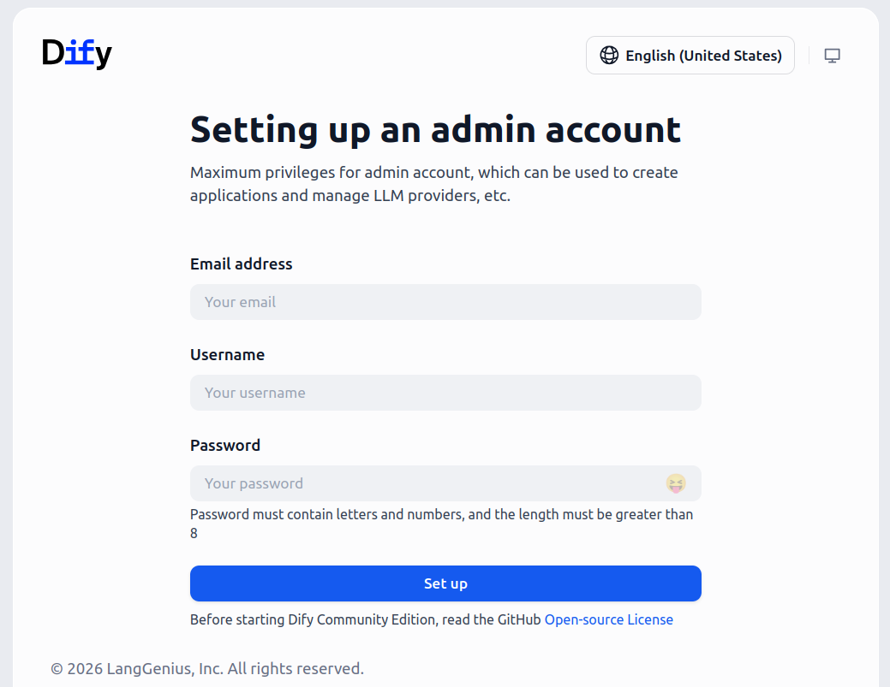

## Dify $\rightarrow$ Ollama接続

Dify公式は「DockerでDifyを動かすなら、OllamaのURLは `host.docker.internal` か LAN IP を使う」と明記しています([legacy-docs.dify.ai Ollama][2])。
Linuxは `host.docker.internal` が効かない/不安定なことがあるので、LAN IP方式が推奨になります。

### ホストLAN IPを取得

```bash
ip route get 1.1.1.1 | awk '{print $7; exit}'
```

例：`192.168.1.20` が出たら、以下は `http://192.168.1.20:11434`

### OllamaがLANから見えるようにする（重要）

Ollamaはデフォルトで `127.0.0.1:11434` にバインドします。外部（＝Difyコンテナ）から見せるには環境変数の`OLLAMA_HOST`を変えます。

#### OllamaをLANバインドで実行(OLLAMA_HOST環境変数を使うだけ)

ターミナルで：

```bash
$ LAN_IP=$(ip route get 1.1.1.1 | awk '{print $7; exit}')
$ OLLAMA_HOST=$LAN_IP:11434 ollama serve
```

別ターミナルで疎通確認：

```bash
$ curl http://$LAN_IP:11434/api/tags
```

例えば、以下のようなJSONが返れば設定完了。恒久化する場合はsystemdに環境変数を入れるやり方が定番ですが、最初は簡易設定で十分です。

```bash
{"models":[{"name":"deepseek-r1:1.5b","model":"deepseek-r1:1.5b","modified_at":"2026-02-13T06:56:58.294031073+01:00","size":1117322768,"digest":"e0979632db5a88d1a53884cb2a941772d10ff5d055aabaa6801c4e36f3a6c2d7","details":{"parent_model":"","format":"gguf","family":"qwen2","families":["qwen2"],"parameter_size":"1.8B","quantization_level":"Q4_K_M"}}]}
```


### Difyの画面でOllamaプロバイダー設定

Dify管理画面 $\rightarrow$ **Settings** $\rightarrow$ **Model Providers** $\rightarrow$ **Ollama**

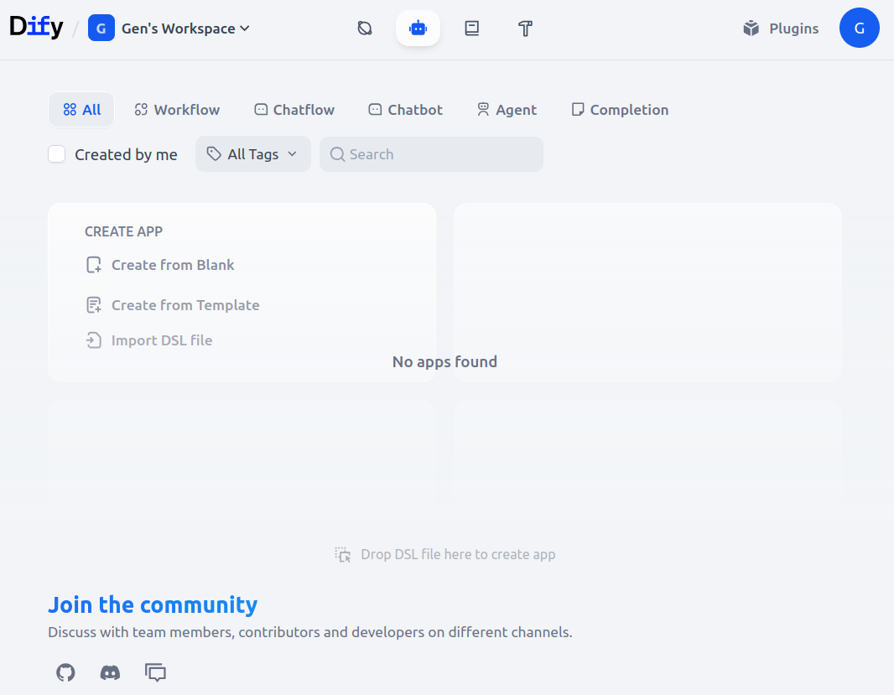

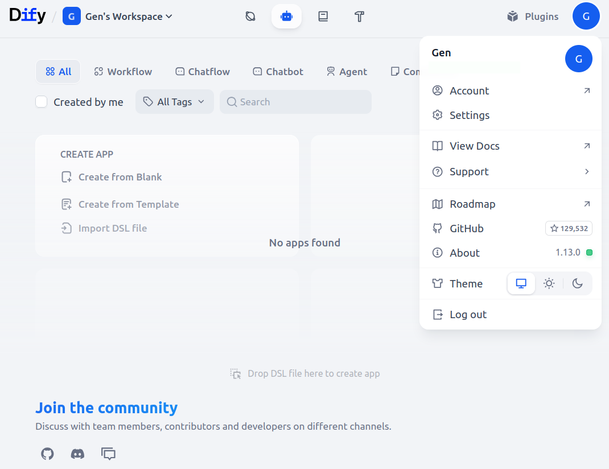

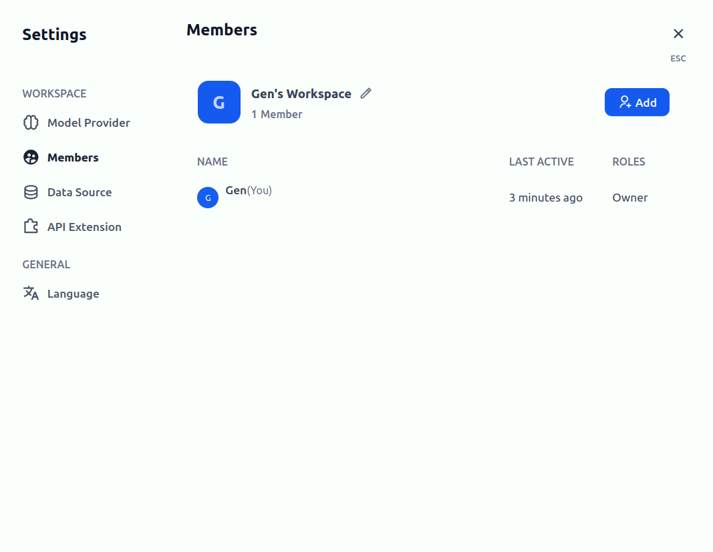


[Add Model]ボタンを押して、

* **Model name**: `deepseek-r1:1.5b` $\rightarrow$ Dify公式のDeepSeek+Ollama事例でも同系モデルを前提
* **Base URL**: `http://<LAN_IP>:11434` $\rightarrow$ もしくは `http://host.docker.internal:11434` が効く環境ならそれも可能
* Model Type: Chat
* Context length: 4096（不明ならデフォルト）
  
[Add]ボタン追加したら成功。


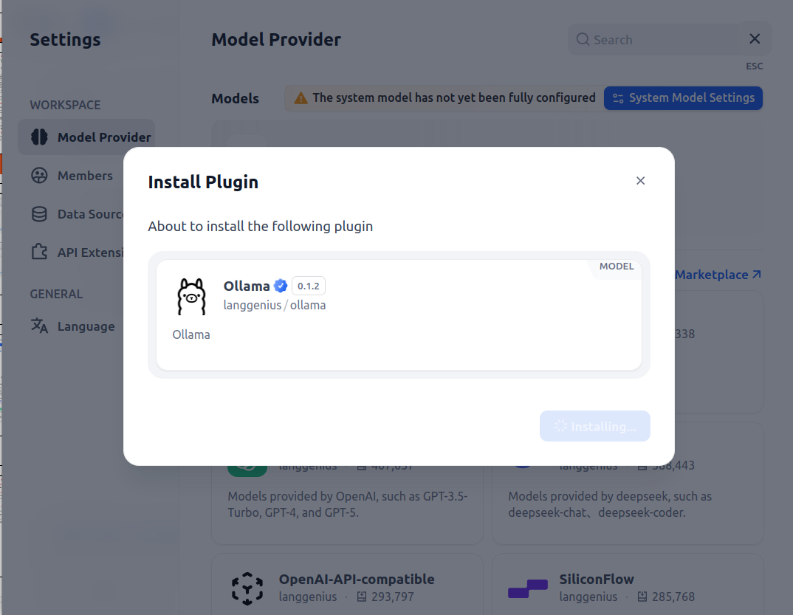


### 最小チャットアプリを作って動作確認
  
Difyで新規 App → Chat（または最もシンプルなテンプレ）を追加する。モデルに `deepseek-r1:1.5b` を指定して、1往復会話して応答が返れば最初の設定はクリア。


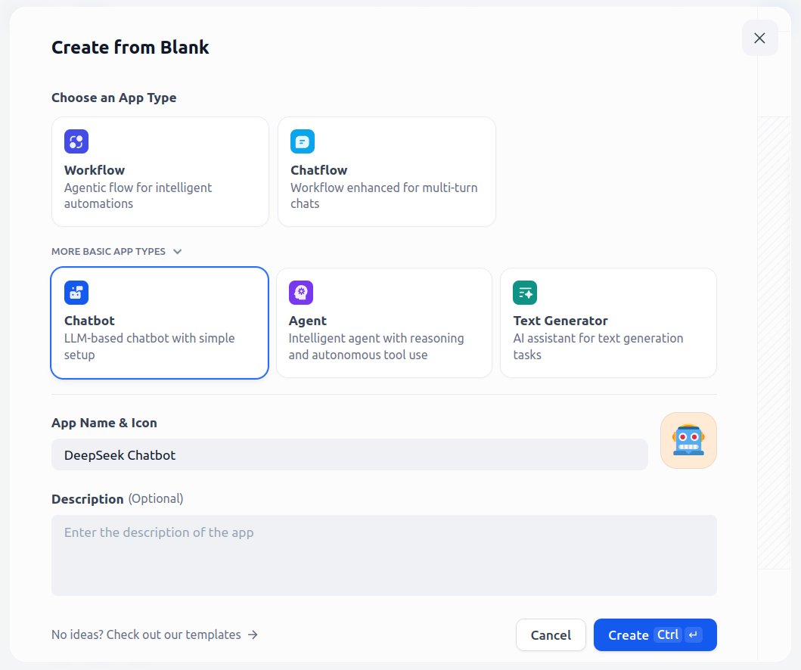

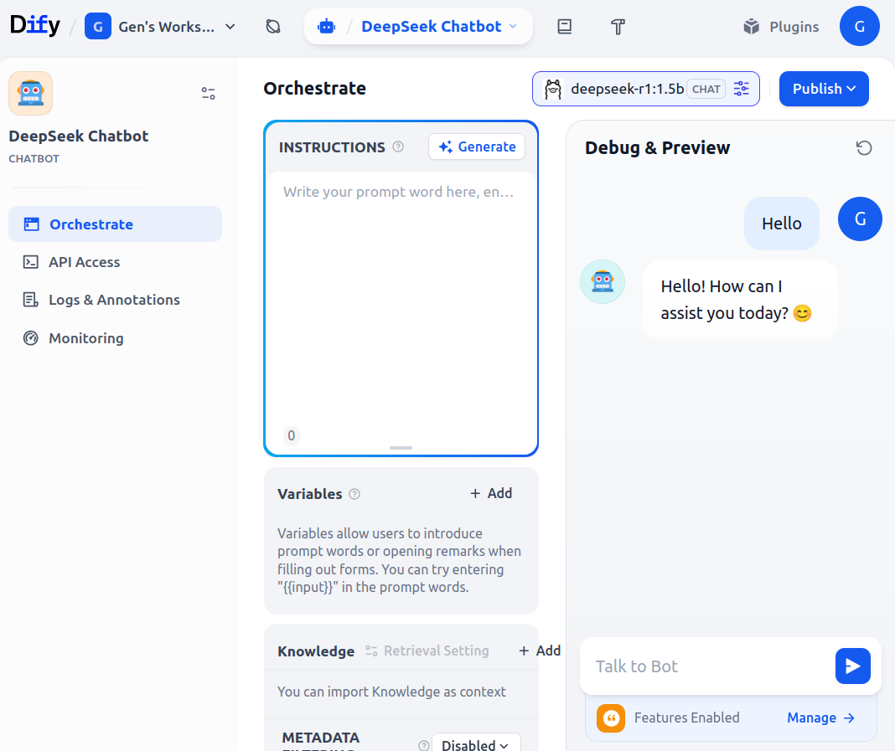


  


## トラブルシューティング


###  `localhost:11434` を入れてしまう
  
Docker内のlocalhostなのでNG（Dify→Ollamaへ届かない）
  
###  `curl http://<LAN_IP>:11434/api/tags` が返らない
  
* Ollamaが 127.0.0.1 にしかバインドしてない
* `OLLAMA_HOST=0.0.0.0:11434 ollama serve` を実行し直す

### DifyからOllamaへLAN_IP経由で繋がらない

Difyコンテナ $\rightarrow$ Ollama(LAN_IP:11434) にTCP接続できていない（タイムアウト）

* ファイヤーウォール

```bash
$ sudo ufw allow 11434/tcp
```

* Dify上のDockerコンテナから確認

モデルが返れば成功

```bash
$ docker exec -it docker-api-1 sh -lc "apk add --no-cache curl >/dev/null 2>&1 || true; curl -sS http://192.168.81.215:11434/api/tags | head"
```

### Difyインターフェース上からOllamaのモデルが見つからない。

モデルが見えるか確認する。スペルミス等ありえる。モデルの設定は`.ollama`から読まれるが、実行ユーザーollamaとモデルの場所が違う場合にモデルが空になる。

* モデルが空の場合
```
{"models":[]}
```


* `.ollama`パスをちゃんとリンクする。

```
$ ln -vs /usr/share/ollama/.ollama ~
```

* 確認

```bash
$ LAN_IP=$(ip route get 1.1.1.1 | awk '{print $7; exit}') 
$ curl -s http://$LAN_IP:11434/api/tags

{"models":[{"name":"deepseek-r1:1.5b","model":"deepseek-r1:1.5b","modified_at":"2026-02-13T06:56:58.294031073+01:00","size":1117322768,"digest":"e0979632db5a88d1a53884cb2a941772d10ff5d055aabaa6801c4e36f3a6c2d7","details":{"parent_model":"","format":"gguf","family":"qwen2","families":["qwen2"],"parameter_size":"1.8B","quantization_level":"Q4_K_M"}}]}
```

  
## 参考リンク
  
  1. Dify Docker Compose クイックスタート（公式） ([docs.dify.ai Quick][1])
  2. Dify × Ollama 統合（公式：Base URLの注意が明確） ([legacy-docs.dify.ai Ollama][2])
  3. Ollama FAQ（OLLAMA_HOSTで公開できる） ([Ollama Docs FAQ][3])
  4. Ollama + DeepSeek + Dify のプライベートデプロイ ([legacy-docs.dify.ai DeepSeek][4])
  
  [1]: https://docs.dify.ai/en/self-host/quick-start/docker-compose "Deploy Dify with Docker Compose"
  [2]: https://legacy-docs.dify.ai/development/models-integration/ollama "Integrate Local Models Deployed by Ollama"
  [3]: https://docs.ollama.com/faq "FAQ"
  [4]: https://legacy-docs.dify.ai/ja-jp/learn-more/use-cases/private-ai-ollama-deepseek-dify "Ollama + DeepSeek + Dify"

  

\newpage
# ＲＡＧの実装と検証

この章ではPDF文書1本を使用して **RAGが動く**ことを目標にします。何はともあれ動いて検証するということに重点をおいてパラメータを変えて挙動を見てみましょう。

RAGについての概略を説明し、Chunk_size、Top_k、Temperature、Embeddingを触って差を観察し、どう精度が変わるのかを説明していきます。


## RAG（Retrieval Augmented Generation）の概略

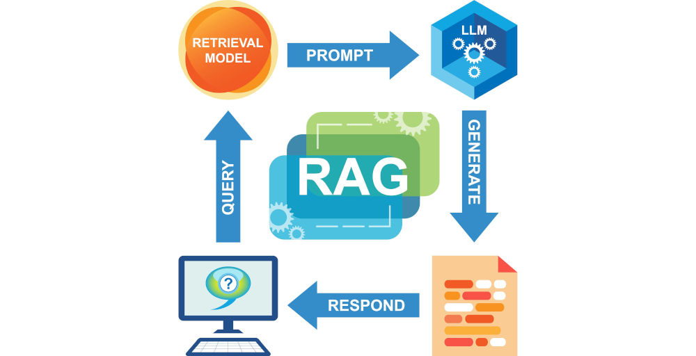

#### 検索の流れ：質問 $\rightarrow$ Embedding（意味ベクトル化）$\rightarrow$ ベクトルDBで類似検索 $\rightarrow$ 関連チャンク Top_k 件取得 $\rightarrow$ LLMへ渡す $\rightarrow$ 回答生成
		  


RAG（Retrieval Augmented Generation）とは、大規模言語モデル（LLM）に外部知識を動的に参照させることで、回答の正確性と文脈適合性を高める手法である[@lewis2020rag][@facebook2020ragblog][@dify2026knowledge][@openai2026embeddings]。通常のLLMは事前学習されたパラメータの範囲内でのみ回答を生成するが、RAGでは質問に応じて関連文書を検索し、その情報をコンテキストとして与えた上で生成を行う。これにより、モデル自体を再学習することなく、最新情報や社内限定情報を活用できる。

RAGの基本構造は大きく三段階に分かれる。

1. 文書を適切な単位（Chunk）に分割し、それぞれをEmbedding（意味ベクトル化）する。
2. ユーザーの質問も同様にEmbeddingし、ベクトル空間上で類似度検索を行う。
3. 上位の関連チャンク（Top_k）をLLMへ渡し、それらを参照しながら回答を生成する。

この流れは「検索（Retrieval）」と「生成（Generation）」の明確な責任分離によって成立している。

実務導入においてRAGが重要視される理由は、モデルの再学習を行わずに企業独自の知識を活用できる点にある。社内マニュアル、契約書、技術仕様書などをナレッジとして登録することで、閉じた環境内でAIを活用できる。特にローカルLLMと組み合わせることで、データを外部に送信せずに業務支援AIを構築することも可能である。

重要なのは、RAGは単なる「検索＋生成」ではないという点である。検索精度はEmbeddingモデルとChunk設計に依存し、生成精度はプロンプト設計およびTemperatureなどの生成パラメータに依存する。つまりRAGの品質は、(1) 文書分割（Chunk）の妥当性、(2) 意味検索の精度（Embedding）、(3) 生成時の制御（Top_k）、という三つの設計要素のバランスで決まる。どれか一つが適合してないと、回答は不安定になる。**RAGは「導入すれば自動で賢くなる」技術ではなく、実務上では設計と検証を繰り返す試行錯誤による工学的対象になる**。

本書では、Difyを用いてローカルLLM環境下でRAGを構築し、Chunk設計、Embedding選択、Top_k調整、Temperature制御といった各要素がどのように精度へ影響するかを実験的に検証する。目的は単に動かすことではなく、動かして、調整し、なぜ精度が変わるのかを理解することにある。

用語説明：


* Chunk : 文脈の単位。元のドキュメントを**検索可能な単位に分割したテキスト片**のこと。RAGではPDFや文書全体をそのまま扱うのではなく、数百〜千文字程度の塊に分割してEmbeddingし、ベクトル検索する。チャンクが大きすぎるとノイズが混ざりやすく、小さすぎると文脈が壊れる。Chunk設計は「文脈の保存」と「検索精度」のバランス設計のこと。RAG精度はChunkに大きく依存する。
* Top_k : 情報量の制御。ベクトル検索で**上位何件のチャンクをLLMに渡すかを決めるパラメータ**のこと。例えば、$Top_k = 3$なら、質問に最も近い3つのチャンクを取得する。小さすぎると重要情報を取りこぼし、大きすぎると無関係な情報が混入し、生成精度が落ちる。Top_kは「情報の網羅性」と「ノイズ制御」のトレードオフ調整レバーになる。
* Embedding : 意味の変換。**テキストを意味を保持した数値ベクトルに変換する処理**のこと。RAGではこのベクトル同士の距離（類似度）で関連文書を検索する。Embeddingモデルが弱いと、意味検索が正しく働かず、質問と無関係なチャンクが選ばれる。特に日本語を扱う場合は、multilingual対応モデルを選ぶことが精度に直結する。EmbeddingはRAGの“検索の質”を決める基礎になる。
* Temperature : 表現の揺らぎ。LLMの**出力のランダム性（＝創造性）を制御する値**。低い（例: 0.1〜0.3）ほど決定的で安定した出力になり、高い（例: 0.7〜1.0）ほど多様で創造的になる。例えば、画像生成AIでは影響が顕著に見える（低いと同じような画像ばかりになり、高いとクリエイティブに感じる）。RAG用途では通常、事実性が重要なため低めに設定するのが基本。Temperatureは検索精度には影響せず、生成の表現と揺らぎに影響する。


		  


## Dify上でKnowledge Base（知識基盤）を作る


#### Dify $\Rightarrow$ Knowledge $\Rightarrow$ Create Knowledge $\Rightarrow$ Import from file $\Rightarrow$ PDFをアップロード

### 準備

* PDFを用意する（20〜30ページ）。おすすめは「章がはっきりしていて用語が繰り返し出る」技術文書。（例：プロトコル解説、API仕様の一部、社内手順書の抜粋など）
  - この例では、英文のO'Reillyの「[Hands-on Machine Learning with Scikit-Learn, Keras & TensorFlow](https://amzn.to/4cqxXpd)」の第１章（約３０ページ）を使用します。
* Knowledge Base作成時に選ぶ “Chunk Mode” は後から変更できない。ただし区切り文字や最大長などのチャンク設定は調整可能。 ([docs.dify.ai - Chunk][rag1])
* TopK、Score Threshold、Rerankは「検索で拾うチャンクの量と質」を直接変える。([docs.dify.ai - Index Method][rag2])


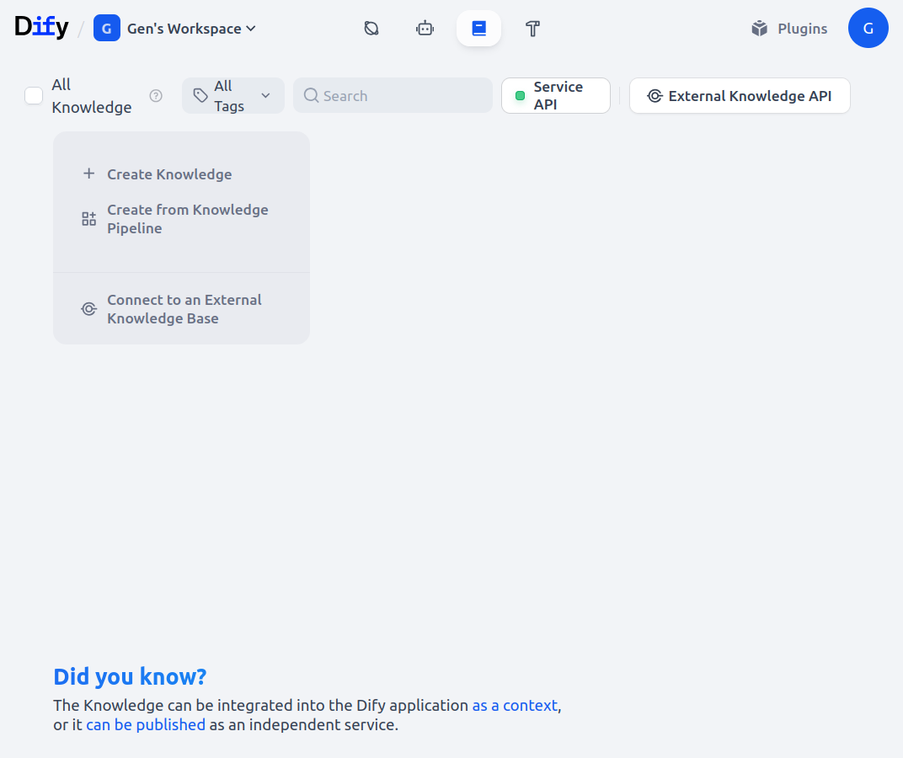

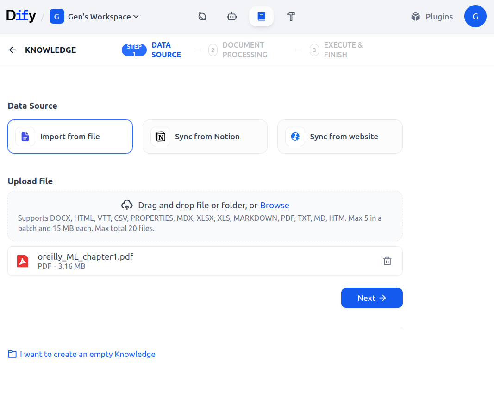

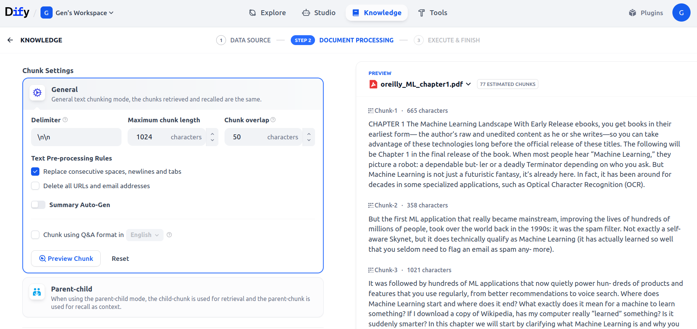

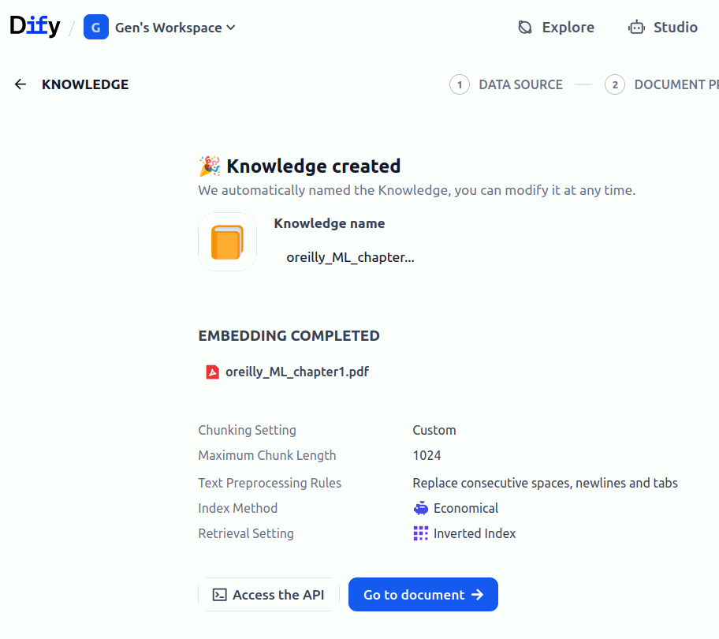


## 設定

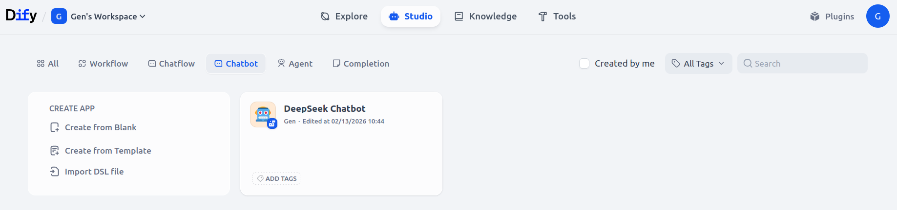

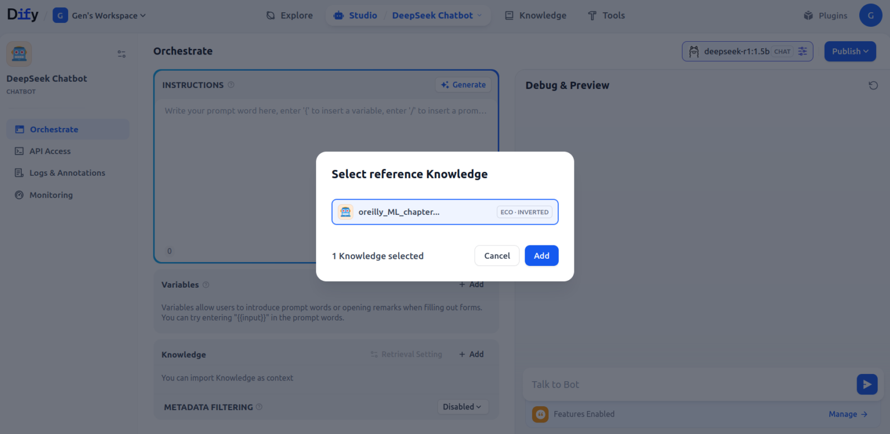

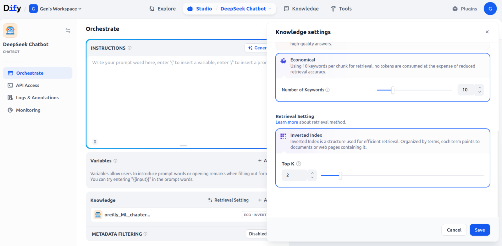


### Chunking設定


「Chunking and cleaning text」画面で設定します。まずは以下の２パターンを同じPDFファイルで比較する。

1. 粗い：max chunk length 800〜1200 くらい
2. 細かい：max chunk length 300〜500 くらい

Difyは「各ドキュメントごとにチャンク設定を持てる」ので、同じKnowledge内でも比較しやすい。


### Embeddingモデルを選ぶ（最初は外部推奨）

日本語が混ざる可能性があるなら **multilingual系**が無難。Difyチュートリアルでも言及がある。日本語対応の設計としては

* 生成：Ollama deepseek-r1:1.5b（ローカル）
* Embedding（検索）：外部（multilingual対応。例えばChatGPT API）

等で行う。この例ではO'Reillyの英文テキストを使うのでこの部分は深く考えない。Ollamaから使える無料版の`bge-m3`を使用する。

#### 設定方法

1. モデルをインストール

```
$ ollama pull bge-m3
```

2. Dify上で"Settings" $\rightarrow$ "Model Provider" $\rightarrow$ "Ollama" $\rightarrow$ "Add Model" で選択。設定項目は"Embedding"と"bge-m3"を選択する以外はDeepSeek Chatbotとほぼ同様。

3. Embeddingモデルを変更したら"Knowledge"からもう一度"Save & Process"ボタンを押して、念の為Indexを再度作成しておく。

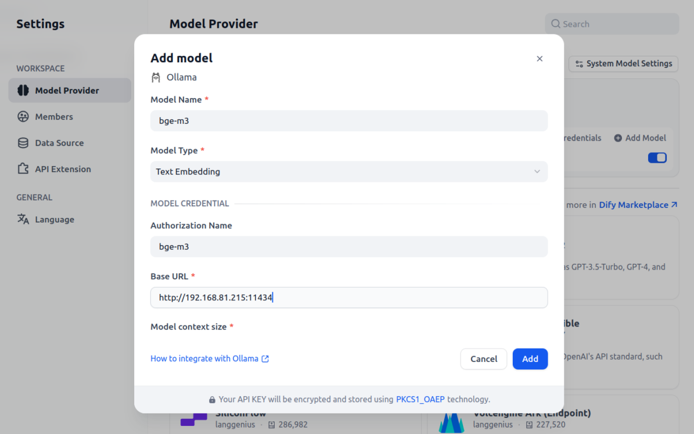

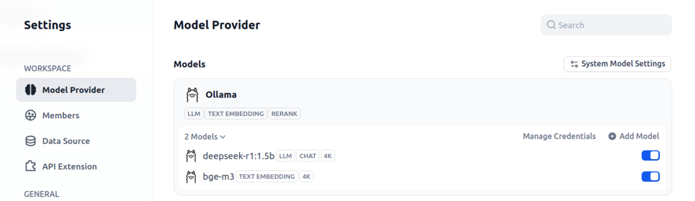


### Retrieval設定（TopK / Score Threshold / Rerank）

Knowledge作成後（または設定画面）で **Indexing method / Retrieval settings** を触る。

### TopKの比較（最低2点）

* **TopK = 2**
* **TopK = 6**

TopKは「拾うチャンク数」。小さいと取りこぼし、大きいとノイズ混入が増えやすい、というトレードオフ。

### Score Threshold

0.3 / 0.5 / 0.7 あたりで試す。これは、高いほど厳選、低いほど拾う。

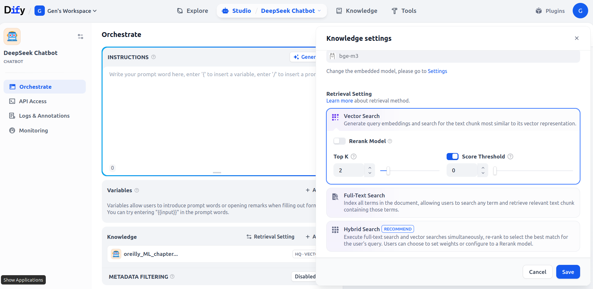

### Rerank

Rerankが使える構成なら「TopKで多めに拾って、Rerankで上位を整列」が効きます（使えるモデルがあれば）。Difyのモデル種別として rerank が存在する点は公式にも説明があります。


## 検索テスト

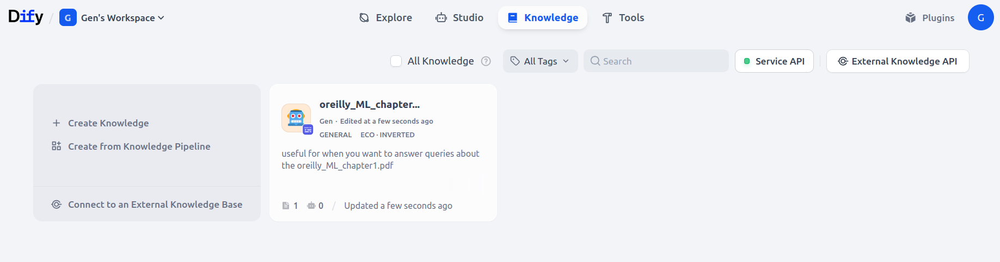

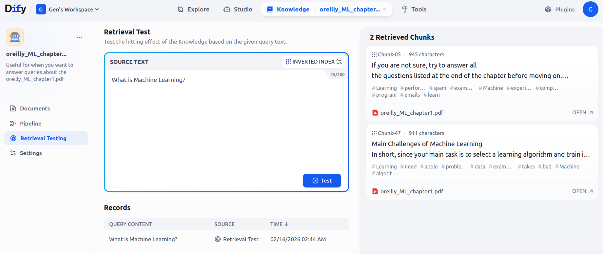

### Difyの「Retrieval Test」で“検索の質”を評価

非常に重要な項目といて、Knowledge（データセット）には **テスト検索（Retrieve / Test retrieval）**があり、まずここで「検索が正しく当たってるか」を見ます。

### テスト用クエリ例（PDFが技術文書の場合）

文書として機械学習の本の第一章を与えているので、その知識を問い合わせてみます。

1. "What is Machine Learning according to Hands-on Machine Learning book?"
2. "What is the difference between supervised learning and unsupervised learning?"
3. "What is the difference between batch learning and online learning?"
4. "What is overfitting and how can it be reduced?"
5. "What is the purpose of a validation set in Machine Learning?"


#### ここで見るべき観点

* 上位チャンクが「質問と同じ節」から取れているか
* 余計な章が混ざっていないか
* チャンクが短すぎて文脈が欠けていないか（細かすぎ問題）
* チャンクが長すぎて要点が埋もれていないか（粗すぎ問題）


## 使ってみる

### アプリ側（チャットボット）で temperature を比較する

前章で作ったDeepSeekチャットアプリ（Ollama）に Knowledgeを紐づけて（"Integrate knowledge within apps"）RAG回答させます。

temperature比較はこの2点で行う

1. **temp = 0.2**（堅め：根拠重視）
2. **temp = 0.7**（柔らかめ：言い回し増える）

RAGで重要なのは「検索が当たってる」ことなので、temperature設定は最後に触る。

### 任意：APIでRetrievalを叩いて再現性を上げる

Difyには **Dataset retrieve（テスト検索）API**がある。UIで見た結果を、APIでも同条件で再現できる。


## 検証結果のまとめ


```md
# RAG検証ログ

## PDF
- タイトル：Hands-on Machine Learning with Scikit-Learn, Keras & TensorFlow, O'Reilly
- ページ数：33
- 想定用途：FAQ / 手順 / 仕様参照

## 実験パラメータ
### Chunk
- A: max chunk length = 1024
- B: max chunk length = 512

### Retrieval
- TopK: 2 / 6
- Score threshold: 0.3 / 0.5 / 0.7
- Rerank: off

### Embedding
- provider/model: "bge-m3"

### Generation
- LLM: deepseek-r1:1.5b (Ollama)
- temperature: 0.2 / 0.7

## テストクエリ（5個）
1. "What is Machine Learning according to Hands-on Machine Learning book?"
2. "What is the difference between supervised learning and unsupervised learning?"
3. "What is the difference between batch learning and online learning?"
4. "What is overfitting and how can it be reduced?"
5. "What is the purpose of a validation set in Machine Learning?"

## 観察結果（結論から）
- 一番良かった組み合わせ：Chunk 1024, Top_K 6, Threashold 0.3, Temperature 0.2
- 悪かった組み合わせ：Chunk 1024, Top_K 2, Threashold 0.7, Temperature 0.7

Top_Kである程度広い範囲を検索結果に出してThreasholdで厳選する方が原文に忠実かつ適度に要約してくれる。Citationも出す。Temperatureも低めの方が無用な創造性を発揮せず手堅い。逆に、Top_Kが低く、Threashold高めでTemperature（創造性大）であると無駄な単純化や構成が多くなる。現状ではまだ好みの問題である。ただし、大量の文書を入力した場合に、正しくKPIを設定してないとユーザーによっては不満が募るはず。

## なぜ精度が変わるのか?
- チャンクが粗い → （例：ノイズ増/要点が埋まる）
- チャンクが細かい → （例：文脈欠落/断片化）
- TopKが小さい → 取りこぼし
- TopKが大きい → 低関連チャンク混入
- threshold高い → 厳選されるが漏れる
- threshold低い → 拾うがノイズ増
- embeddingが合わない → 意味検索が弱い（特に多言語）
```


## 参考リンク

1. Chunking and cleaning text（チャンク設定） ([docs.dify.ai - Chunk][rag1])
2. Setting indexing methods（TopK/thresholdなど） ([docs.dify.ai - Index Method][rag2])
3. Integrate knowledge within apps ([docs.dify.ai - Within Apps][rag9])
4. Retrieval test & TopKの意味（補助） ([raglegacy-docs.dify.ai - Retreval Test][rag6])
5. Retrieve chunks API（任意で再現性） ([ragdocs.dify.ai - Retrieve Chunks][rag8])


[rag1]: https://docs.dify.ai/en/use-dify/knowledge/create-knowledge/chunking-and-cleaning-text "Configure the Chunk Settings"
[rag2]: https://docs.dify.ai/en/use-dify/knowledge/create-knowledge/setting-indexing-methods "Specify the Index Method and Retrieval Settings"
[rag3]: https://docs.dify.ai/en/use-dify/knowledge/create-knowledge/import-text-data/readme "Upload Local Files"
[rag4]: https://docs.dify.ai/en/use-dify/knowledge/manage-knowledge/maintain-knowledge-documents "Manage Knowledge Content"
[rag5]: https://docs.dify.ai/en/use-dify/tutorials/customer-service-bot "Customer Service Bot With Knowledge Base"
[rag6]: https://legacy-docs.dify.ai/guides/knowledge-base/retrieval-test-and-citation "Retrieval Test / Citation and Attributions"
[rag7]: https://docs.dify.ai/versions/legacy/en/user-guide/models/model-configuration "Model Configuration"
[rag8]: https://docs.dify.ai/api-reference/datasets/retrieve-chunks-from-a-knowledge-base-test-retrieval "Retrieve Chunks from a Knowledge Base / Test Retrieval"
[rag9]: https://docs.dify.ai/en/use-dify/knowledge/integrate-knowledge-within-application "Integrate Knowledge within Apps"

\newpage
# RAGの理論構造と実践理解

* Embeddingの数学的意味
* ベクトル空間とは何か
* 類似度計算
* 検索と生成の責任分離


## RAGとは何か?

* Retrieval + Generationの分離
* Vector DBの役割
* なぜEmbeddingが必要か
* 生成と検索の責任分離

## チャンク設計の思想

* chunk_sizeの意味
* 文脈破壊のリスク
* 日本語文書特有の課題

## TopKとノイズ問題

* 小さすぎる問題
* 大きすぎる問題
* Rerankの意味

## 精度検証の方法論

* Retrieval test
* 誤答パターン分類
* 再現性のある検証


\newpage
# Dify内部構造の理解

## Difyのアーキテクチャ

* API層
* Worker
* Redis
* Postgres
* Weaviate

## モデルプロバイダの仕組み

* OpenAI型
* Ollama型
* DeepSeek API型

## Plugin / Tool呼び出しの内部

## なぜDifyはLangChainと違うのか


\newpage
#  実務導入パターン

## 社内FAQ型

* ナレッジ限定
* 低リスク

## 技術文書検索型

* 精度要求高い
* Chunk設計重要

## 契約書・法務型

* セキュリティ重視
* オンプレ優先

## エージェント型

* ワークフロー
* 外部API連携

## AIタイプ別整理

* 単純QA型
* ワークフロー型
* エージェント型
* 推論特化型（DeepSeek等）

\newpage
# 開発スタイル

## なぜウォーターフォールは失敗するか

## PoC（Proof-Of-Concept）主導開発

* 概念実証モデルの重要性
* 小さく動かす
* 期待値調整

## RAGのアジャイル改善

* データ改善
* Prompt改善
* Retrieval調整

## Scrumとの統合

* スプリント単位の評価指標
* Definition of Done

## 精度KPIの設定方法


\newpage
# セキュリティとガバナンス

## 外部APIのリスク

## ローカルLLMの限界

## ハイブリッド構成

## データ分類とAI利用ポリシー

## 監査・ログ設計

\newpage
# 将来展望

## 何ができるのか？

## マルチエージェント化

## 自律型AI

## 日本市場の可能性

## 小規模LLMの未来


\newpage
# TODO

## 資料作成補助（スライド等）AI

## 画像生成AI

## 音声生成AI

## 動画生成AI

## 面接・人材採用システム用ワークフロー

\newpage
# Appendix: DifyをAWSで使う

## 参考リンク

  1. Difyでの生成AIアプリケーション構築ワークショップ（AWS Workshop Studio）([dify.aws.studio][1])

  [aws1]: https://catalog.us-east-1.prod.workshops.aws/workshops/95a3c231-2064-4a33-9a3d-624b7c11aaa6/ja-JP "Difyでの生成AIアプリケーション構築ワークショップ"


\newpage
# Appendix: Dify DockerをUbuntuで使う

多少古いディストリビューションですが、Ubuntu20は安定しているのでこの版でDocker Compose V2が動作するようにします。クラウド環境だとそのまま最新のDockerやモジュールをインストールすれば良いでしょう。

### Dockerの事前環境

```bash
docker --version
docker-compose version
```

#### 出力例

```
$ docker --version
Docker version 24.0.5, build 24.0.5-0ubuntu1~20.04.1

$ docker-compose version
docker-compose version 1.25.0, build unknown
docker-py version: 4.1.0
CPython version: 3.8.10
OpenSSL version: OpenSSL 1.1.1f  31 Mar 2020
```


### 古いDocker関連を整理（安全）

```bash
sudo apt-get remove docker docker-engine docker.io containerd runc
```

（データは消えない）

#### Ubuntu20の標準へ戻す場合

```bash
sudo apt-get install docker.io
```

#### 公式Docker版
```bash
sudo apt-get install docker-ce docker-ce-cli containerd.io docker-compose-plugin
```

#### 完全削除

```bash
sudo apt-get purge docker.io
sudo rm -rf /var/lib/docker
```

これをやらない限りデータは残る。apt-get removeではデータは残るのが普通。


### 公式Dockerリポジトリ追加

```bash
sudo apt-get update
sudo apt-get install -y ca-certificates curl gnupg

sudo install -m 0755 -d /etc/apt/keyrings

curl -fsSL https://download.docker.com/linux/ubuntu/gpg | sudo gpg --dearmor -o /etc/apt/keyrings/docker.gpg

echo "deb [arch=$(dpkg --print-architecture) signed-by=/etc/apt/keyrings/docker.gpg] https://download.docker.com/linux/ubuntu $(lsb_release -cs) stable" | sudo tee /etc/apt/sources.list.d/docker.list > /dev/null
```


### 最新Docker Compose v2をインストール

```bash
sudo apt-get update
sudo apt-get install -y docker-ce docker-ce-cli containerd.io docker-buildx-plugin docker-compose-plugin
```


### 確認

```bash
docker --version
docker compose version
```

#### 出力

```
Docker version 28.1.1, build 4eba377
Docker Compose version v2.35.1
```

これでDify Dockerを動かす準備が整いました。

\newpage
# 参考文献
